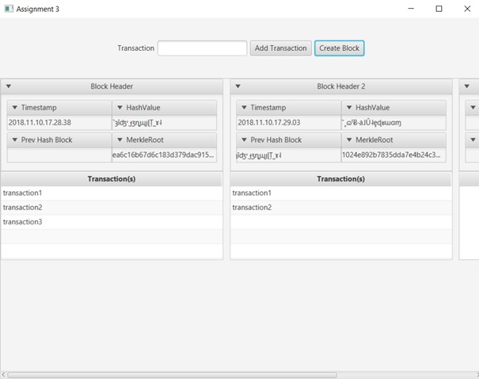

# DAT510 Assignment Three

A simple cryptology Java project with an JavaFx interface which implement a simplified Blockchain.

It was made with Intellij IDEA.

It uses an adaptation of the following Merkle Tree implementation : http://java-lang-programming.com/en/articles/29

# Requirements
Need Java 9 or higher to be run because of JavaFx.


# Structure
```
├── src
|    ├── Block.java         Java class representing a block
|    ├── block.fxml         fxml file which define each block interface      
|    ├── BlockHeader.java   Java class representing a block header     
|    ├── Controller.java    Contains all the methods triggered by the interface       
|    ├── Hash.java          Java class where my custom hashing logic is
|    ├── Main.java          Java class to run
|    ├── MerkleTree.java    Java class where the Merkle Tree logic is
|    ├── sample.fxml        fxml file which define the interface
|    └── Transaction.java   Java class representing a Transaction      
|
└──README.md
 ```
# Screens

